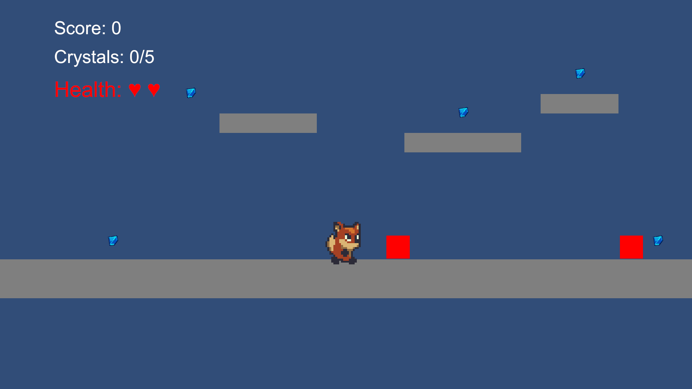
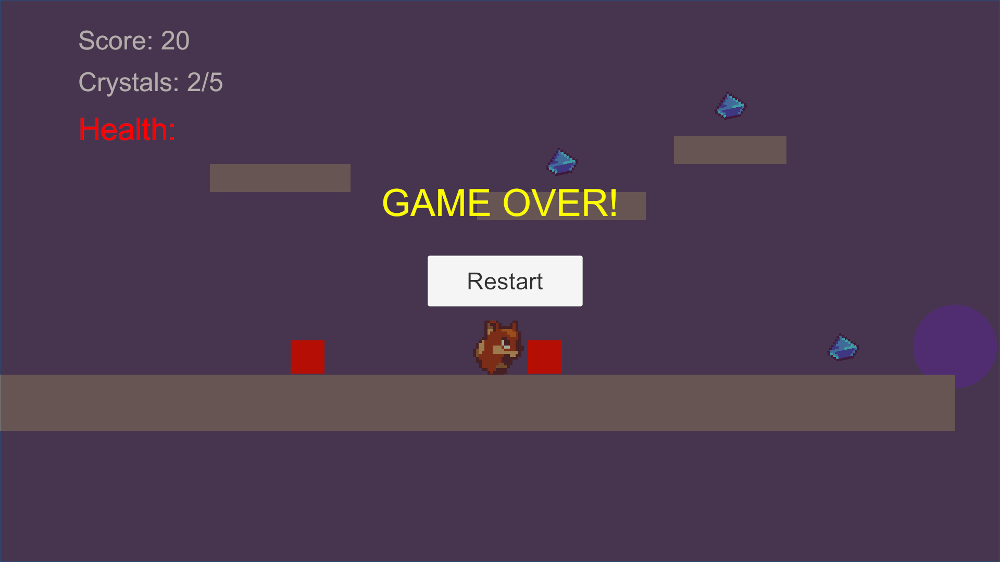
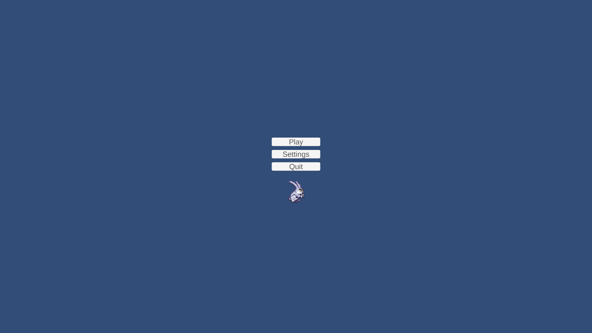
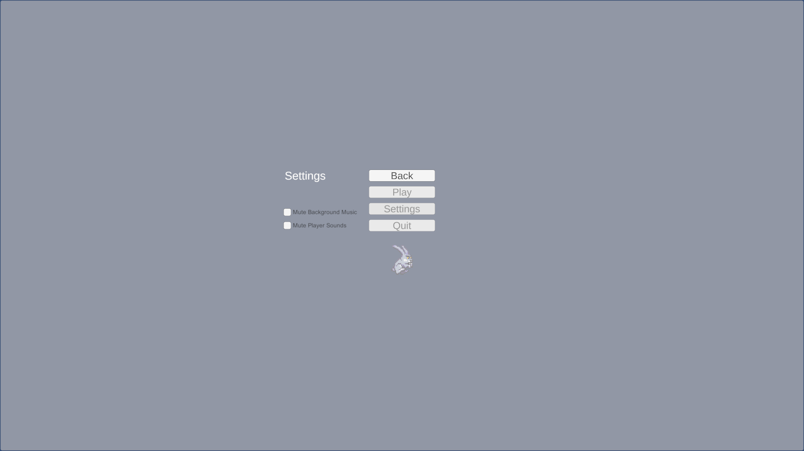
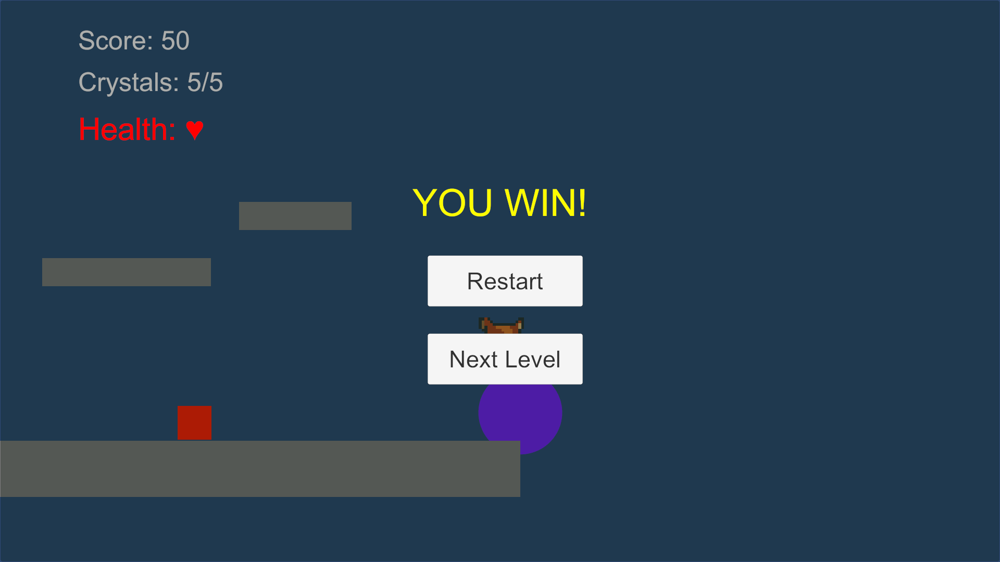

<div align="center">

# 🌟 **Crystal Quest – Unity 2D Platformer**

A polished 2D adventure platformer where players collect crystals, avoid enemies, and reach the magical exit portal to progress through multiple levels.  
Built using **Unity (C#), Tilemaps, Animations, AI**, and optimized game mechanics.

**Version:** 1.0.0  
**Engine:** Unity 2021 LTS  
**Language:** C#  
**Genre:** 2D Platformer Adventure


</div>

---

<div>

## 📖 **Table of Contents**
- [Team Members](#-team-members)
- [Game Overview](#-game-overview)
- [Controls](#-controls)
- [Features](#-main-features)
- [How to Run](#-how-to-run)
- [Build Instructions](#-build-instructions)
- [Script Documentation](#-script-documentation)
- [Game Mechanics](#-game-mechanics-explained)
- [Assets](#-art--audio-assets)
- [Troubleshooting](#-troubleshooting)
- [Credits & License](#-credits)

---

</div>

<div>

## 👥 **Team Members**
- **Dhruv Jivani** *(Git Master)*
- **Jeel Patel** *(Group Leader)*
- **Aayushi Ravalji**
- **Isha Patel**
- **Dilraj Singh**

**Institution:** Conestoga College  
**Course:** Game Development – Final Project

</div>

---

<div>

## 🎮 **Game Overview**

**Crystal Quest** is a multi-level 2D platformer featuring engaging gameplay mechanics and polished visuals.

### Core Features:
- ✨ **Crystal Collection System** – Collect all crystals to unlock the exit
- 👹 **Enemy Patrol AI** – Challenging enemies with intelligent patrolling
- ❤️ **Health & Damage System** – Player health management and enemy damage
- 🌀 **Portal Unlock System** – Dynamic portal activation based on crystal collection
- 🎥 **Smooth Camera Follow** – Responsive camera that follows the player
- 🏞️ **Tilemap-based Levels** – Multiple levels with varied layouts
- 🎵 **Audio System** – Background music and sound effects with mute controls
- 💾 **Persistent Save Data** – Remembers last played level and audio preferences

### Gameplay Flow:
```
Main Menu → Select Level → Collect Crystals → Unlock Portal → Reach Exit → Win → Next Level
```

> **Goal:** Collect all crystals → Unlock the portal → Reach the exit → Progress through multiple levels

### Technical Highlights:
- Singleton pattern for global managers (GameManager, AudioManager)
- Physics-based player movement with proper jump mechanics
- Efficient collision detection and trigger systems
- Responsive UI with real-time stat tracking
- Cross-platform compatibility

</div>

---

<div>

## 🕹️ **Controls**

| Action | Key(s) |
|--------|--------|
| Move Left | **A** or **← (Left Arrow)** |
| Move Right | **D** or **→ (Right Arrow)** |
| Jump | **Space** or **W** |
| Restart Level | **R** |
| Return to Menu | **ESC** |

### Gamepad Support (Coming Soon)
- Left Stick for movement
- A/Cross button for jump
- Menu button for pause

</div>

---

<div>

# 🖼️ **Game Screenshots**

<div style="display: flex; gap: 20px; justify-content: center;">
  
  
</div>

<div style="display: flex; gap: 20px; justify-content: center; margin-top: 20px;">
  
  
  
  
</div>

</div>

---

<div>

## 📂 **Project Structure**

```
Assets/
├── Scripts/
│ ├── PlayerController.cs
│ ├── Enemy.cs
│ ├── Crystal.cs
│ ├── GameManager.cs
│ ├── CameraFollow.cs
│ └── ExitPortal.cs
├── Scenes/
│ ├── MainMenu.unity
│ ├── MainLevel.unity
│ ├── MainLevel1.unity
│ ├── MainLevel 2.unity
│ ├── MainLevel 3.unity
│ └── WinScene.unity
├── Art/
│ ├── SunnyLand Artwork
│ └── Dungeon Tileset
├── Audio/
│ ├── SFX/
│ └── Music/
├── Prefabs/
└── UI/
```

</div>

---

<div>

# 🧩 **Main Features**

### ✔ **Player Movement**
- Smooth physics-based movement  
- Coyote time for better jumping  
- Ground detection  
- Animation transitions  

### ✔ **Crystal Collection**
- Rotating & pulsing collectibles  
- Sound effect on pickup  
- UI crystal counter  

### ✔ **Enemy AI**
- Patrols between points  
- Flips direction  
- Damages player  

### ✔ **Game Manager (Singleton)**
- Tracks score & health  
- Tracks total crystals  
- Controls UI  
- Manages level transitions  
- Win/Lose logic  

### ✔ **Exit Portal System**
- Unlocks after all crystals are collected  
- Shows activation effect  

### ✔ **Health System**
- Enemy contact reduces health  
- Respawn system  
- Game Over UI  

### ✔ **UI & Feedback**
- Crystal counter  
- Life counter  
- Win screen  
- Game Over screen  

</div>

---

<div>

## 🚀 **How to Run**

### Prerequisites
- **Unity 2021 LTS** or higher  
- **.NET Framework 4.7.1+**  
- **Visual Studio** (for script editing)  

### Steps to Run
1. Clone or download the repository  
2. Open Unity Hub  
3. Click **Add** and select the project folder  
4. Wait for the project to load and import assets  
5. Open the **MainMenu** scene from `Assets/Scenes/`  
6. Press **Play** in the Unity Editor  

### First-Time Setup
- The game will automatically initialize the AudioManager and GameManager singletons
- Settings are saved in PlayerPrefs (music/SFX mute state)
- No additional configuration required

</div>

---

<div>

## 🛠️ **Build Instructions**

1. Open **File → Build Settings**  
2. Add scenes in the following order:
   - MainMenu.unity (Index 0)
   - MainLevel.unity (Index 1)
   - MainLevel1.unity (Index 2)
   - MainLevel2.unity (Index 3)
   - MainLevel3.unity (Index 4)
3. Select **PC, Mac & Linux Standalone** as target platform  
4. Click **Build** and choose a folder  
5. The executable will be generated in the selected folder  

### Build Settings Recommendations
- **Target Platform:** Windows x64 (for best performance)
- **Graphics Quality:** High
- **Resolution:** 1920x1080

</div>

---

<div>

## 📋 **Script Documentation**

### **PlayerController.cs**
Controls player movement, jumping, health, and invincibility frames.
- **Methods:** Update(), FixedUpdate(), TakeDamage(), OnCollisionEnter2D()
- **Key Variables:** moveSpeed, jumpForce, maxHealth, invincibilityTime

### **GameManager.cs** (Singleton)
Manages overall game state, scoring, and UI updates.
- **Methods:** AddScore(), UpdateHealth(), WinGame(), GameOver(), LoadNextLevel()
- **Key Variables:** score, crystalsCollected, totalCrystals

### **Enemy.cs**
Handles enemy AI patrol behavior.
- **Methods:** Update()
- **Key Variables:** moveSpeed, moveDistance, direction

### **Crystal.cs**
Manages crystal collectibles with animation and scoring.
- **Methods:** OnTriggerEnter2D()
- **Key Variables:** pointValue, rotationSpeed, pulseSpeed

### **CameraFollow.cs**
Smoothly follows the player with lerped movement.
- **Methods:** LateUpdate()
- **Key Variables:** smoothSpeed, offset

### **ExitPortal.cs**
Controls the level exit portal activation and win condition.
- **Methods:** Update(), ActivatePortal(), OnTriggerEnter2D()
- **Key Variables:** rotationSpeed, requiredCrystals, isActive

### **AudioManager.cs** (Singleton)
Manages music and sound effects globally across scenes.
- **Methods:** SetMusicMuted(), SetSfxMuted()
- **Key Variables:** isMusicMuted, isSfxMuted

### **MainMenuUI.cs**
Handles main menu interactions (Play, Settings, Quit).
- **Methods:** OnPlayButton(), OnSettingsButton(), OnQuitButton()

### **EscToHome.cs**
Allows players to return to home menu using ESC key and saves last level.
- **Methods:** Update()

</div>

---

<div>

## 🎯 **Game Mechanics Explained**

### **Crystal Collection System**
- Each level contains 5 crystals (configurable)
- Crystals rotate and pulse continuously for visual appeal
- Collecting a crystal plays a sound effect and adds points
- Crystal count displayed in UI

### **Enemy Patrol AI**
- Enemies patrol back and forth within a specified distance
- When enemy contacts player, 1 health is deducted
- Enemies reset position on level restart
- Configurable speed and patrol distance

### **Health & Invincibility**
- Player starts with 3 hearts (health)
- After taking damage, player becomes temporarily invincible (flashing effect)
- Invincibility duration prevents instant death chains
- When health reaches 0, Game Over screen appears

### **Portal Unlock System**
- Portal starts semi-transparent and inactive
- Once all crystals collected, portal becomes fully visible
- Player can then enter portal to complete the level
- Displays crystal requirement feedback to player

### **Level Progression**
- MainMenu → Player selects level or resumes last played
- Upon level completion, player can advance to next level
- Last played level is saved in PlayerPrefs
- All levels return to MainMenu upon completion of all levels

</div>

---

<div>

## 🎨 **Art & Audio Assets**

### **Visual Assets Used**
- **SunnyLand Artwork Pack** (Sprites & Tilesets)
- **2D Dungeon Pixel Art Tileset** (Level design)
- **Custom UI** (Buttons, Panels, HUD)

### **Audio Assets**
- **Background Music:** Looping ambient/adventure tracks
- **Sound Effects:**
  - Jump sound
  - Crystal collection chime
  - Enemy collision/damage
  - Game Over/Win fanfare

### **Importing Custom Assets**
1. Place sprite sheets in `Assets/Sprites/`
2. Set sprite texture import settings appropriately
3. Create prefabs in `Assets/Prefabs/`
4. Configure in scenes or scripts as needed

</div>

---

<div>

## 🧪 **Known Issues & Limitations**
- Audio balancing may vary depending on system volume
- Performance can drop with 15+ enemies on screen simultaneously
- Physics calculations may vary slightly on different frame rates
- Some visual effects may not display optimally at very high resolutions

### **Planned Improvements**
- Mobile touch controls support
- Leaderboard system
- Additional level content
- Power-up system
- Boss encounters
- Difficulty settings

</div>

---

<div>

## 🔧 **Troubleshooting**

### **Issue: Game crashes on startup**
- Solution: Delete `Library/` folder and reimport project

### **Issue: Audio not playing**
- Solution: Check AudioManager Singleton is in scene, verify audio clips are assigned

### **Issue: Player falls through tilemap**
- Solution: Ensure Tilemap Collider is enabled and Physics2D settings are correct

### **Issue: Crystals not appearing**
- Solution: Verify Crystal prefab references, check Layer Mask settings

### **Issue: Camera not following player**
- Solution: Ensure MainCamera tag is set on camera, verify player Transform reference

</div>

---

<div>

## 📊 **Performance Metrics**
- **Target Frame Rate:** 60 FPS
- **Average Memory Usage:** ~200-300 MB
- **Build Size:** ~150-200 MB (with all assets)
- **Recommended System:**
  - **CPU:** Intel i5 or equivalent
  - **RAM:** 4GB minimum
  - **GPU:** Integrated graphics sufficient

</div>

---

<div>

## 📜 **Credits**
- *SunnyLand Art Pack – Unity Asset Store*  
- *Pixel Dungeon Tileset*  
- *Free Public SFX Packs*  

</div>

---

<div>

## 📘 **License**
This project is created for **academic use** as part of **Conestoga College – Final Project** requirements.

</div>

---

<div align="center">

### ⭐ Additional Notes
This project follows clean object-oriented structure, reusable prefabs, and scalable level design—allowing more levels and mechanics to be added easily.

</div>
